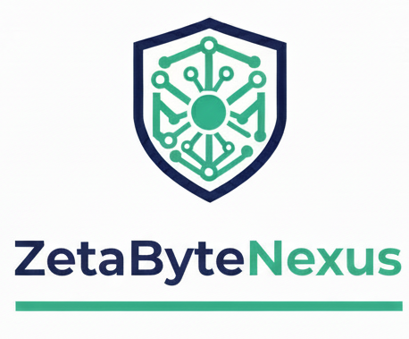

<!-- Intestazione aziendale -->

INDIRIZZO COMPLETO Via Mazzo,73/B  
CAP CITTÀ 20017 RHO (MI) – ITALIA  
P.IVA / CF: BNFSFN66B13F704A 
Email: [info@zetabytenexus.it](mailto:info@zetabytenexus.it)  
Telefono: 335 7388349  
Sito web: [www.zetabytesnexus.it](https://www.zetabytesnexus.it)

---

# Preventivo n. {{NUMERO_PREVENTIVO}}

Cliente: {{RAGIONE_SOCIALE}}  
Referente: {{REFERENTE}}  
Data: {{DATA}}  
Validità: {{VALIDITA}} (es. 30 giorni)

---

## 1. Contesto e obiettivi

{{DESCRIZIONE_CONTESTO}}

Obiettivi principali del progetto:
- {{OBIETTIVO_1}}
- {{OBIETTIVO_2}}
- {{OBIETTIVO_3_OPZIONALE}}

Decisioni aperte da definire in fase di analisi iniziale:
- {{DECISIONE_1_OPZIONALE}}
- {{DECISIONE_2_OPZIONALE}}

---

## 2. Ambito del progetto

### In scope

{{IN_SCOPE}}

### Fuori scope / esclusioni

{{FUORI_SCOPE}}

---

## 2.b Rischi e dipendenze (opzionale)

{{RISCHI_DIPENDENZE}}

---

## 3. Articolazione per milestone

| Milestone | Descrizione | Ore stimate | Importo |
|----------|-------------|------------:|--------:|
| M1 – {{TITOLO_M1}} | {{DESC_M1}} | {{ORE_M1}}h | {{IMPORTO_M1}} € |
| M2 – {{TITOLO_M2}} | {{DESC_M2}} | {{ORE_M2}}h | {{IMPORTO_M2}} € |
| M3 – {{TITOLO_M3}} | {{DESC_M3}} | {{ORE_M3}}h | {{IMPORTO_M3}} € |
| **Totale** |   | **{{ORE_TOTALI}}h** | **{{IMPORTO_TOTALE}} €** |

Note sulle stime:
- Le ore includono sviluppo, comunicazione, revisioni ragionevoli, test e documentazione interna essenziale.
- Le stime sono basate sulle informazioni attualmente disponibili e potranno essere raffinate in fase di analisi dettagliata.

---

## 4. Modello di prezzo

{{DESCRIZIONE_MODELLO_PREZZO}}

---

## 5. Condizioni economiche

- Importo complessivo stimato: **{{IMPORTO_TOTALE}} € + IVA (se applicabile)**
- Pagamento:
  - {{PERC_1}}% alla firma
  - {{PERC_2}}% a metà progetto
  - {{PERC_3}}% a collaudo

Eventuali altre condizioni:
- Termini di pagamento (es. 30gg data fattura)
- Penali / ritardi solo se concordati esplicitamente

---

## 6. Garanzia e manutenzione

- Periodo di garanzia correttiva: **{{PERIODO_GARANZIA}}** (es. 30 giorni) su bug di produzione.
- Dopo la garanzia:
  - Retainer manutenzione: {{RETAINER_IMPORTO}} €/mese per {{RETAINER_ORE}}h incluse
  - Interventi extra: {{TARIFFA_ORARIA_POST}} €/h

---

## 7. Prerequisiti e responsabilità del cliente

Il cliente si impegna a fornire:
- Un referente unico decisionale
- Accesso a sistemi e dati necessari
- Feedback su prototipi e rilascio entro tempi concordati

---

## 8. Prossimi passi

1. Call di dettaglio per chiarire requisiti aperti.
2. Conferma scritta del presente preventivo.
3. Emissione della fattura di acconto e pianificazione attività.

---

_Firmato digitalmente da NOME TUA AZIENDA / TUO NOME PROFESSIONALE_
