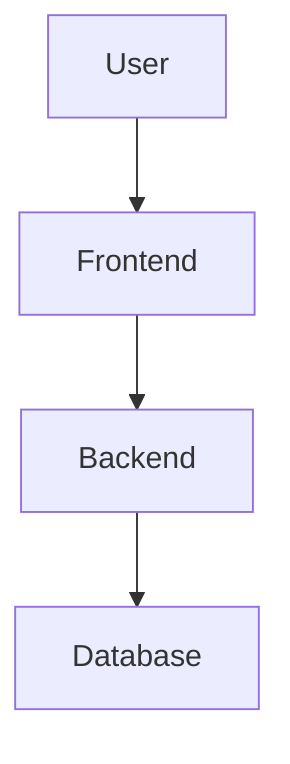
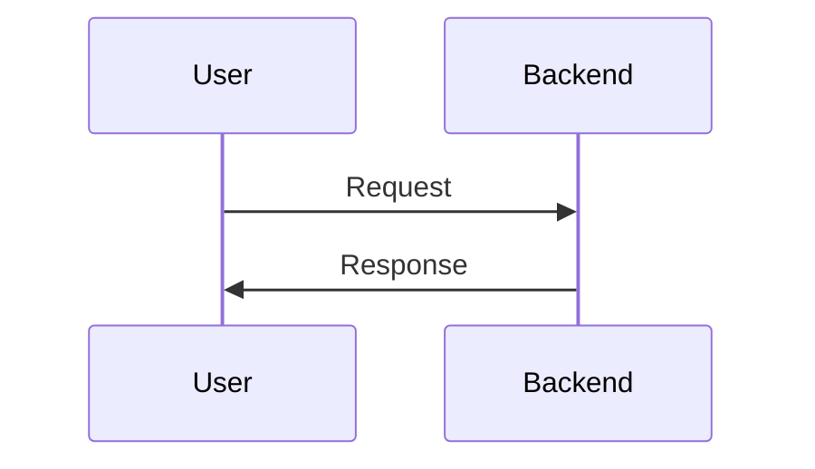

# Technical Specification

## Overview
Brief project description.

## Architecture

## Technology Stack
- Frontend:
- Backend:
- Database:

## Data Flow

## ADR (Architecture Decision Records)
- [ADR-001]: ...
